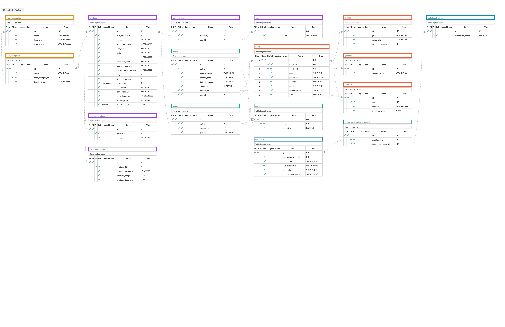

# Weket-kurly Project 
식품 전문 온라인 전용 쇼핑몰 [마켓 컬리](https://www.kurly.com/shop/main/index.php) 클론 프로젝트

## 팀원 구성
- Back-end 2명
- Front-end 3명 ([git repository](https://github.com/wecode-bootcamp-korea/weketkurly-frontend))

## Skill
- Python
- Django
- Requests
- BeautifulSoup
- Pandas
- CORS headers
- Bcrypt
- JWT
- MySQL
- Git
  
## API
[Postman Documentation](https://lahanhotel.postman.co/collections/10398712-5faf389a-97cb-4821-9361-3f30ba875a00?version=latest&workspace=d7f5a55d-4000-4c2c-9009-b4de89ee6806#e162fc1c-abc1-4fa3-a8f7-032ae7f38860)  
[GET]    category  
[GET]    sub category  
[GET]    sub category product list  
[GET]    main category product list  
[GET]    product detail  
[GET]    recommendation  
[GET]    search products
[GET]    new products  
[GET]    best products  
[GET]    sale products  
[GET]    related product  
[POST]   sign up  
[POST]   sign in  
[POST]   check account  
[POST]   check email  
[GET]    user information  
[POST]   cart product create  
[GET]    cart read  
[POST]   cart product update  
[DELETE] cart product delete  
[GET]    user address list  
[POST]   order  
[GET]    order list  
[GET]    credit card information  
  
## DB Modeling  
  
[Aquery URL](https://aquerytool.com:443/aquerymain/index/?rurl=6fc7d34f-9187-4837-9cd7-c37918756338&)  
Password : 47k7ye  

## Features  
- 카테고리 별로 상품과 세부사항, 태그 크롤링
- 상품의 이름, 짧은 설명, 세부사항을 기반으로 하는 검색 기능 구현
- 특정 상품과 관련된 상품 리스트 구현
- 가장 잘 팔린 상품 상위 99개, 올해 입고된 신 상품, 할인 상품 리스트 구현
- 상품을 장바구니에 추가하고, 수량 업데이트, 삭제, 장바구니에 담긴 상품을 볼 수 있는 cart CRUD 구현
- 장바구니에 담긴 상품을 주문하고, 사용자 별로 주문 내역 볼 수 있는 기능 구현
- 사용자가 주문시 기입했던 주소 목록을 재주문시 선택할 수 있는 기능 구현
- 페이지네이션
- 사용자 회원가입 및 비밀번호 암호화 기능
- 가입시 적절한 Email, ID 인지 확인하는 기능(중복여부, 기준)
- 로그인시 사용자에게 토큰 발행 
  
## Demonstration Video

## contact me
E-mail : ljy6816@gmail.com
